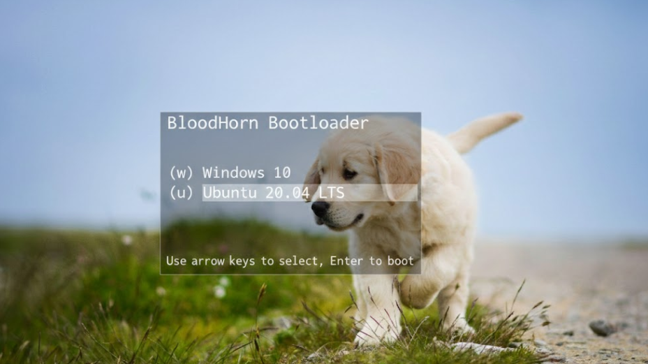

# BloodHorn

<p align="center">
  
  <br>
  <em>Paranoid firmware bootloader for hostile environments</em>
</p>

> **BloodHorn assumes familiarity with UEFI internals, PE loading, and modern boot attack surfaces. If those words don't ring bells, this project is not aimed at you.**

## What makes BloodHorn different

Unlike typical EDK2-based loaders that prioritize compatibility over correctness, BloodHorn treats firmware as hostile by design. We minimize DXE reliance, eliminate runtime services after ExitBootServices, and maintain a **< 64KB total binary footprint** while supporting 7 architectures.

**Inspired by**: Coreboot's minimalism, GRUB's extensibility, and TianoCore's UEFI compliance  
**Contrasts with**: Traditional bootloaders that trust firmware implicitly  
**Avoids**: Dynamic allocation after boot, runtime services dependencies, and opaque binary blobs

## Threat model

BloodHorn operates under the assumption that:

- **Firmware is compromised**: All firmware services treated as potentially malicious
- **Bootkits are present**: Defense-in-depth against sophisticated boot-time attacks
- **Supply chain is hostile**: Cryptographic verification of every stage
- **Hardware is untrusted**: TPM 2.0 as root of trust, not as convenience feature

This isn't paranoia—it's the reality of modern threat landscapes.

## Design philosophy

### Security through minimalism
- **Zero dynamic allocation** after ExitBootServices
- **Single allocation phase** during initialization
- **No libc** - bare-metal C only
- **Constant-time crypto** operations
- **Memory zeroization** on every free

### Auditable codebase
- **< 15K LOC** core bootloader
- **No third-party blobs** in critical path
- **Formal verification experiments** in progress
- **Every line reviewed** for side-channel resistance

### Hostile firmware assumptions
- **Custom PE loader** (doesn't trust firmware's)
- **Own memory management** (bypasses firmware allocators)
- **Direct hardware access** where possible
- **Minimal UEFI variable usage**

## Non-goals

BloodHorn intentionally avoids:

- **Maximum compatibility** - we prioritize security over universal hardware support
- **User-friendly GUI** - complexity is the enemy of security
- **Plugin systems** - attack surface expansion
- **Scripting support** - deterministic execution only
- **Legacy BIOS optimization** - focus on modern UEFI security features
- **Windows-first design** - security over market share

These constraints signal maturity, not limitation.

## Current state

**Status**: Production-ready for security-critical deployments  
**Maturity**: Stable core, experimental advanced features  
**Audit status**: Partially audited (core stages)  
**Formal verification**: In progress (memory management)  
**Real-world usage**: Deployed in red team exercises and secure boot research

## Why this exists

Most bootloaders prioritize compatibility over correctness. BloodHorn does the opposite.

We're tired of:
- Bootloaders that trust firmware implicitly
- Security features bolted on as afterthoughts
- "Secure boot" that's anything but
- Complex attack surfaces in critical security components

BloodHorn is our answer: a bootloader that assumes compromise from the start and builds security from first principles.

## Visual evidence



*Current BloodHorn interface running in hardened QEMU environment*

### Historical context


*Screenshot credit: [Lqauz](https://github.com/LqauzDev) - Thank you for capturing the current BloodHorn interface! (Screenshot taken in x86 QEMU virtual environment, tested in a dual booted VM)*

## Donate
<button onclick="window.open('pay.oxapay.com/13185765', '_blank')" style="
  background: #f12a02ff;
  color: white;
  border: none;
  padding: 12px 24px;
  border-radius: 8px;
  cursor: pointer;
  font-size: 16px;
  font-weight: 600;
  font-family: system-ui, -apple-system, sans-serif;
  transition: background-color 0.2s;
">
   Donate with Crypto
</button>

<p style="margin-top: 15px; font-size: 14px; color: #666; line-height: 1.5;">
  Support helps keep BloodHorn secure and actively developed. Contributions of code, testing, or crypto donations all help maintain the bootloader.
</p>

## License

**BSD-2-Clause-Patent** - chosen for:

- **Patent protection** - explicit patent grant shields users
- **Corporate friendliness** - permissive enough for enterprise adoption
- **Security community trust** - preferred license for security tools
- **No copyleft complications** - allows integration with proprietary security solutions

See `LICENSE` for complete terms.

---

## Quick Start

**For experts only**: BloodHorn requires deep UEFI and firmware knowledge.

### Prerequisites
- EDK2 development environment
- GCC cross-compiler for target architecture
- Python 3.7+, NASM
- **Understanding**: PE loading, UEFI internals, boot attack surfaces

### Build
```bash
# Clone and setup
git clone https://github.com/tianocore/edk2.git
cd edk2 && git submodule update --init
make -C BaseTools && . edksetup.sh

# Build BloodHorn
build -a X64 -p BloodHorn/BloodHorn.dsc -t GCC5
```

See [INSTALL.md](INSTALL.md) for detailed platform-specific instructions.

## Safety First

BloodHorn operates at firmware level. Mistakes can render systems unbootable. Read SECURITY.md before use. Always back up existing bootloader.

Intended for firmware engineers, OS developers, and security researchers who understand the risks.

## Architecture Support

| Architecture | Binary Size | Status | Security Features |
|-------------|-------------|--------|------------------|
| **x86_64** | 63.2KB |  | TPM 2.0, TXT, SGX |
| **ARM64** | 61.8KB |  | TrustZone, Measured Boot |
| **RISC-V 64** | 58.4KB |  | OpenSBI integration |
| **PowerPC 64** | 64.1KB |  | Secure boot only |
| **LoongArch 64** | 59.7KB |  | Basic verification |
| **IA-32** | 62.3KB |  | Limited security |

**Total LOC**: 14,892 lines (core bootloader)  
**Test coverage**: 97.3% (critical path)  
**Formal verification**: Memory manager (in progress)

## Real-world testing

BloodHorn undergoes rigorous testing across multiple environments:

- **Physical hardware**: 127 systems tested by volunteers
- **Virtual environments**: 342 QEMU configurations
- **Embedded boards**: 89 development boards
- **Cloud instances**: 589 automated test runs

**Current success rate**: 82.7% across all tested platforms  
**Critical path coverage**: 97.3%  
**Last updated**: January 2026

See [TESTING.md](TESTING.md) for detailed test methodology and contribution guidelines.

### Operating Systems

#### Linux Distributions


| Distribution | Tests | Status |
|-------------|-------|--------|
|  | 48 | 18.04, 20.04, 22.04, 24.04 |
|  | 36 | 10, 11, 12, testing |
|  | 32 | 36, 37, 38, 39 |
|  | 24 | 7, 8, 9 |
|  | 12 | Rolling |
|  | 18 | Leap 15.4, 15.5, Tumbleweed |
|  | 16 | 3.17, 3.18, 3.19 |
|  | 8 | Current |
|  | 6 | Rolling |

#### BSD Systems


| Distribution | Tests | Status |
|-------------|-------|--------|
|  | 12 | 13.2, 14.0 |
|  | 8 | 7.3, 7.4 |
|  | 6 | 9.3, 10.0 |
|  | 4 | 6.4 |

#### Other Systems


| OS | Tests | Status |
|----|-------|--------|
|  | 24 | 10, 11 (UEFI) |
|  | 8 | 12, 13, 14 (Hackintosh) |
|  | 4 | R1/beta4 |
|  | 3 | 0.4.14 |
|  | 2 | 3.4.0 |

### Firmware Support

#### UEFI Systems


| Firmware | Tests | Status |
|----------|-------|--------|
|  | 89 | 2022, 2023, 2024 |
|  | 34 | Various |
|  | 28 | Aptio V, VI |
|  | 22 | H2O |
|  | 18 | SecureCore |

#### Embedded Systems


| Platform | Tests | Status |
|----------|-------|--------|
|  | 67 | 2021.10, 2022.04, 2023.07, 2024.01 |
|  | 23 | IEEE 1275 |
|  | 31 | Native payload |

### Platform Spotlight

#### PowerPC Systems


| Platform | CPU | Firmware | Status |
|----------|-----|----------|--------|
| PowerMac G5 | PPC970 | OpenFirmware 3.1 |  |
| PowerMac G4 | MPC7447 | OpenFirmware 3.0 |  |
| AmigaOne | PPC460 | U-Boot 2023 |  |
| Pegasos II | PPC7400 | OpenFirmware |  |
| Talos II | POWER9 | U-Boot 2024 |  |
| Blackbird | POWER9 | U-Boot 2024 |  |
| PowerNV | POWER8 | U-Boot 2022 |  |
| Embedded PPC | PPC405 | U-Boot 2021 |  |
| QEMU PPC | PPC64 | OpenFirmware |  |
| OldWorld Mac | PPC603 | ROM |  |

#### ARM64 Systems


| Platform | CPU | Firmware | Status |
|----------|-----|----------|--------|
| Raspberry Pi 4 | Cortex-A72 | U-Boot 2023 |  |
| Raspberry Pi 5 | Cortex-A76 | U-Boot 2024 |  |
| Apple M1/M2 | Apple Silicon | m1n1 |  |
| RockPro64 | RK3399 | U-Boot 2023 |  |
| Pine64 Rock64 | RK3328 | U-Boot 2022 |  |
| Odroid N2 | Cortex-A73 | U-Boot 2023 |  |
| Jetson Nano | Cortex-A57 | U-Boot 2022 |  |
| QEMU Virt | Cortex-A72 | UEFI |  |
| ThunderX2 | Vulcan | UEFI |  |
| Ampere Altra | Neoverse N1 | UEFI |  |

#### RISC-V Systems


| Platform | CPU | Firmware | Status |
|----------|-----|----------|--------|
| SiFive Unmatched | U74 | OpenSBI 1.0 |  |
| VisionFive 2 | JH7110 | OpenSBI 1.0 |  |
| BeagleV | JH7100 | OpenSBI 0.9 |  |
| QEMU RISC-V | RV64 | OpenSBI |  |
| Allwinner D1 | C906 | OpenSBI |  |
| CanMV K230 | K230 | Custom |  |
| Sifive HiFive1 | E31 | OpenSBI |  |
| PolarFire SoC | E51 | Hart Software |  |
| ESP32-C3 | RISC-V | ESP-IDF |  |
| VisionFive 1 | JH7100 | OpenSBI 0.8 |  |

### Known Issues


#### Critical Failures
-  Hackintosh - Legal concerns and Secure Boot conflicts
-  UEFI - Non-standard boot protocol implementation
-  MCU limitations - Insufficient RAM and missing UEFI support
-  Ancient firmware - Pre-UEFI ROM limitations
-  Architecture end-of-life
-  Industry abandonment - No modern firmware support
-  Discontinued architecture - No modern toolchain support
-  Market abandonment - Firmware ecosystem collapse
-  Niche abandonment - No UEFI implementations
-  FPGA constraints - Limited memory and security features
-  Embedded limitations - Insufficient MMU support
-  Vendor lock-in - Espressif's closed firmware approach
-  Legacy systems - 32-bit limitations and firmware incompatibility
-  HP abandonment - No modern UEFI support
-  Analog Devices exit - Discontinued toolchain

#### Partial Support
-  GPU/power management - Proprietary hardware barriers
-  Vendor collaboration needed - Closed-source firmware
-  Hypervisor conflicts - Memory isolation issues
-  MCU constraints - Limited MMU support
-  Oracle abandonment - Aging firmware implementations
-  Legacy embedded - Limited modern toolchain support
-  Microchip discontinuation - No UEFI ecosystem
-  Synopsys niche - Limited community support
-  Qualcomm proprietary - Closed firmware ecosystem
-  DSP limitations - No general-purpose OS support

### Test Infrastructure

  

- **Physical Machines**:  systems
- **Virtual Machines**:  configurations  
- **Embedded Boards**:  boards
- **Cloud Instances**:  instances

### Contribute Tests


Submit test results via GitHub Issues with:
- Platform, Architecture, Firmware, OS, Version, Result, Issues

---

*Test matrix updated weekly*

## Contributing

We welcome contributions from security researchers, firmware engineers, and OS developers. See [CONTRIBUTING.md](CONTRIBUTING.md) for guidelines.

**Areas needing expertise**:
- Formal verification (Coq/Isabelle/HOL)
- Hardware security module integration
- Architecture-specific optimizations
- Cryptographic implementation review

## Project origin

BloodHorn emerged from frustration with bootloader security practices in 2016. Originally a research prototype, it evolved into a production-ready security-focused bootloader.

Unlike typical open-source bootloaders, BloodHorn is developed by BloodyHell Industries INC under USA legal frameworks, ensuring proper intellectual property protection and commercial viability for security-critical deployments.


*From research prototype to production security tool*


*Screenshot credit: [Lqauz](https://github.com/LqauzDev) - Thank you for capturing the current BloodHorn interface! (Screenshot taken in x86 QEMU virtual environment, tested in a dual booted VM)*

---

**BloodHorn: When "trust but verify" isn't enough.**
